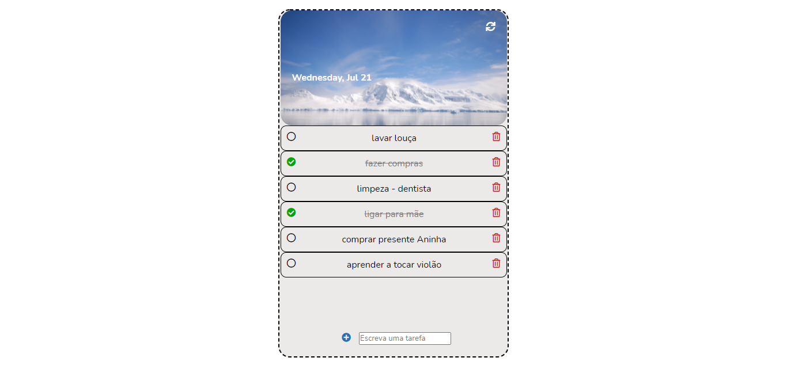

# To Do List

> Status do projeto: Concluído :heavy_check_mark:

## Descrição do projeto

Este projeto é um site para cadastrar uma lista de tarefas a serem realizadas pelo usuário. 
Foi o exercício da sexta semana do bootcamp online de front-end da <a href="https://reprograma.com.br/">{reprograma}</a>, ocorrido nos meses de 
Junho e Julho de 2020. Nessa semana o tema tratado foi a linguagem JavaScript II. Criei o HTML e o CSS do zero, vendo algumas inspirações na 
internet e fiz o código JavaScript também dessa forma.

## Veja como o site ficou 

Para ver o site clique <a href="https://raqcalazans.github.io/ToDoList/">aqui</a>.

